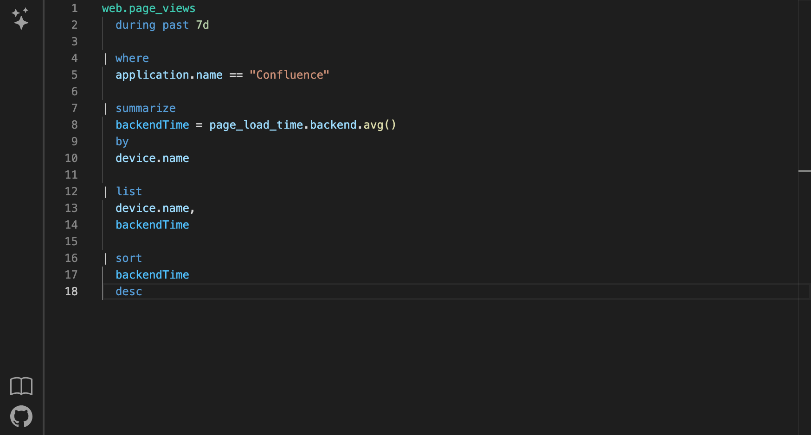

# NQL web formatter

[Demo](https://hendrikkao1.github.io/nql-web-formatter/)

Tool to make [Nexthink query language (NQL)](https://docs.nexthink.com/platform/latest/nexthink-query-language-nql) more readable by applying formatting rules and syntax highlighting using [tree sitter](https://github.com/tree-sitter/tree-sitter).

